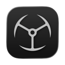

<p align="center"></p>

<h1 align="center">Imperator Dock Folders</h1>

<p align="center">Custom app folders in the macOS Dock.</p>

---

Group the apps you actually use into a folder, put that folder in the Dock, and click it to get
a grid of those apps. Not a Finder stack of aliases — a real popup you lay out yourself: your
own order, your own labels, your own grid size, paged if you want more than fits.

macOS lets you drag a folder to the right side of the Dock and get a stack. Dock Folders puts
your folders on the **left** side among the real apps, gives each one a generated icon showing
what is inside, and opens a keyboard-dismissable popup anchored to the Dock icon.

## Requirements

Requires macOS 14 or later, Apple silicon. Built and tested on macOS 26 only — older versions
are expected to work but have not been verified.

Install at your own risk. The app is not notarized and carries no Apple Developer signature, so
macOS cannot vouch for it. It is provided as is, with no warranty, under the MIT license.

## Install

1. Download the zip from [Releases](https://github.com/goranimperator/imperator-dock-folder/releases)
   and unpack it.
2. Drag **Imperator Dock Folders.app** into `/Applications`. It has to live there — the launcher
   bundles start the app by bundle identifier, and Launch Services resolves that most reliably
   from `/Applications`.
3. The app is signed with a self-signed certificate, not an Apple Developer ID, and it is not
   notarized. Gatekeeper will block the first launch. Right-click the app and choose **Open**,
   then confirm. If macOS still refuses:

```bash
xattr -dr com.apple.quarantine "/Applications/Imperator Dock Folders.app"
```

4. Launch it and grant Accessibility when asked. See below for exactly what that is for.

## Permissions

Dock Folders asks for **one** system permission, and it degrades gracefully without it. Here is
every permission-relevant thing the app does, and why.

### Accessibility — asked for, optional

**System Settings → Privacy & Security → Accessibility**

macOS prompts for this on first launch. The app calls `AXIsProcessTrustedWithOptions`, then uses
the Accessibility API to read the **screen position of your folder's icon in the Dock** so the
popup can be anchored to it with the little arrow pointing at the right tile.

That is the only thing it does with Accessibility. It does not read other apps' windows, does
not observe keystrokes, and does not control other applications.

**If you deny it:** everything still works. The popup falls back to the mouse position captured
at click time, which for a Dock click is within a few pixels of the icon anyway. You can grant
it later, or never.

macOS remembers this grant against the app's code signature. Dock Folders ships signed with a
stable self-signed certificate specifically so the grant survives updates — reinstalling a newer
build does not make you re-tick the box.

### Not asked for, and not needed

To be explicit, since these are the ones people worry about:

| Permission | Needed? | Why not |
|---|---|---|
| **Full Disk Access** | No | The Dock configuration is read and written through `CFPreferences` and `/usr/bin/defaults`, which are the supported APIs for the `com.apple.dock` preference domain. The app never reads `~/Library/Preferences/com.apple.dock.plist` directly, which is what would require FDA. |
| **Files & Folders** (Desktop, Documents, Downloads) | No | The app only ever scans `/Applications`, `/System/Applications`, `~/Applications`, and `/Applications/Xcode.app/Contents/Applications`. None of those are TCC-protected, so no prompt appears and none of your documents are touched. |
| **Input Monitoring** | No | No keyboard or global event taps. The popup's dismiss handling uses ordinary `NSEvent` monitors scoped to the app. |
| **Automation / Apple Events** | No | No AppleScript and no cross-application scripting. Restarting the Dock is `killall Dock`, a plain signal to your own process, not an Apple Event. |
| **Screen Recording** | No | Nothing is captured. Folder icons are drawn from each app's own icon via `NSWorkspace`. |
| **Network** | No | The app makes no network requests. No telemetry, no update check, no analytics. |
| **App Sandbox** | Not enabled | Writing to the Dock's preference domain and creating launcher bundles outside a container are both impossible inside the sandbox. This is why the app cannot ship on the Mac App Store. |

### Where it writes

Everything the app owns lives in one directory:

```
~/Library/Application Support/DockFolders/
```

Your folders, the symlinks to your apps, the per-folder layout config, and the generated
launcher bundles. Deleting that directory resets the app completely.

Outside of that, the app writes to exactly two places:

- **`com.apple.dock` preferences** — adds and removes its launcher bundles from the Dock's
  `persistent-apps` array. It only ever touches entries pointing at its own launchers.
- **`/tmp/dockfolders_open`** — a one-line handoff file. A launcher writes the folder name and
  the mouse position there, posts a Darwin notification, and the app reads the file and deletes
  it immediately.

### Login item — only if you turn it on

**Settings → General → Open at login** registers the app with `SMAppService`. It shows up in
System Settings → General → Login Items like any other, and the toggle removes it. Off by
default.

## Use

- **Menu bar icon** (grid symbol) opens the folder list. Turn it off in Settings if you prefer
  the main window only.
- **New folder** in the main window, then **Add apps** to pick from everything installed.
- **Double-click** a folder name or an app label to rename it. Custom labels are yours and stay
  put; the underlying app is untouched.
- **Drag** apps to reorder. The folder icon regenerates to match.
- **Grid** controls set columns and items per page. More apps than fit means pages.
- **Swipe** horizontally on a trackpad inside the popup to page through.
- **Add to Dock** builds a launcher bundle with the generated icon and drops it into the Dock.
- **Escape** or a click anywhere outside closes the popup.

Apps are added as **symlinks**, not copies and not Finder aliases. Nothing is duplicated on
disk and nothing is moved.

## Build

Requires Xcode. Note the `DEVELOPER_DIR` prefix — a Command Line Tools–only setup cannot build
this.

```bash
DEVELOPER_DIR=/Applications/Xcode.app/Contents/Developer xcodebuild -project DockFolders/DockFolders.xcodeproj -scheme DockFolders -configuration Release build
```

Two build phases matter:

- **Build mousepos Helper** compiles `MouseLocation/main.swift` into `Contents/MacOS/mousepos`.
  The launcher scripts run this tiny binary to capture the mouse position at click time. It is
  compiled here, at build time, on purpose: compiling it on the user's Mac would need `swiftc`,
  which is an xcode-select shim that pops the "Install Command Line Developer Tools" dialog on
  a machine without Xcode.
- **Code Sign** signs the bundle with the self-signed `Imperator Dev` identity. That identity
  is what makes the Accessibility grant survive an update. Building without it in your keychain
  works, but every new build will ask for Accessibility again.

Deploy over an existing install with `rm -rf` first — a plain `cp -R` will not replace the old
bundle:

```bash
pkill -x "Imperator Dock Folders"; rm -rf "/Applications/Imperator Dock Folders.app"; cp -R ~/Library/Developer/Xcode/DerivedData/DockFolders-*/Build/Products/Release/"Imperator Dock Folders.app" /Applications/
```

## Layout

```
DockFolders/DockFolders/
  DockFoldersApp.swift      app delegate, Darwin notification listener, popup entry point
  Models/                   DockFolder, AppEntry
  Services/
    FolderStore.swift       disk is the source of truth; every mutation writes through
    DockController.swift    reads/writes com.apple.dock persistent-apps
    LauncherGenerator.swift generates the launcher .app bundles and their scripts
    IconGenerator.swift     renders the 1024x1024 folder icons
    AppDiscovery.swift      scans the application directories
    DockIconLocator.swift   Accessibility lookup of the Dock tile position
    AppColors.swift         brand tokens
  Views/                    SwiftUI + AppKit UI, FolderPopupPanel is the Dock popup
  Resources/                AppIcon.icns, asset catalog
MouseLocation/main.swift    the mousepos helper source
```

State on disk:

```
~/Library/Application Support/DockFolders/
  FolderName/
    .gridconfig      {"columns": 3, "itemsPerPage": 9}
    .apporder        ["App1.app", "App2.app"]
    .labels          {"Slack.app": "Custom label"}
    Safari.app       symlink -> /Applications/Safari.app
  .launchers/
    FolderName.app/  generated launcher bundle
    mousepos         helper copied out of the app bundle
```

## Third-party

None. SwiftUI and AppKit only, no package dependencies, no vendored code.

## License

MIT. See [LICENSE](LICENSE).
